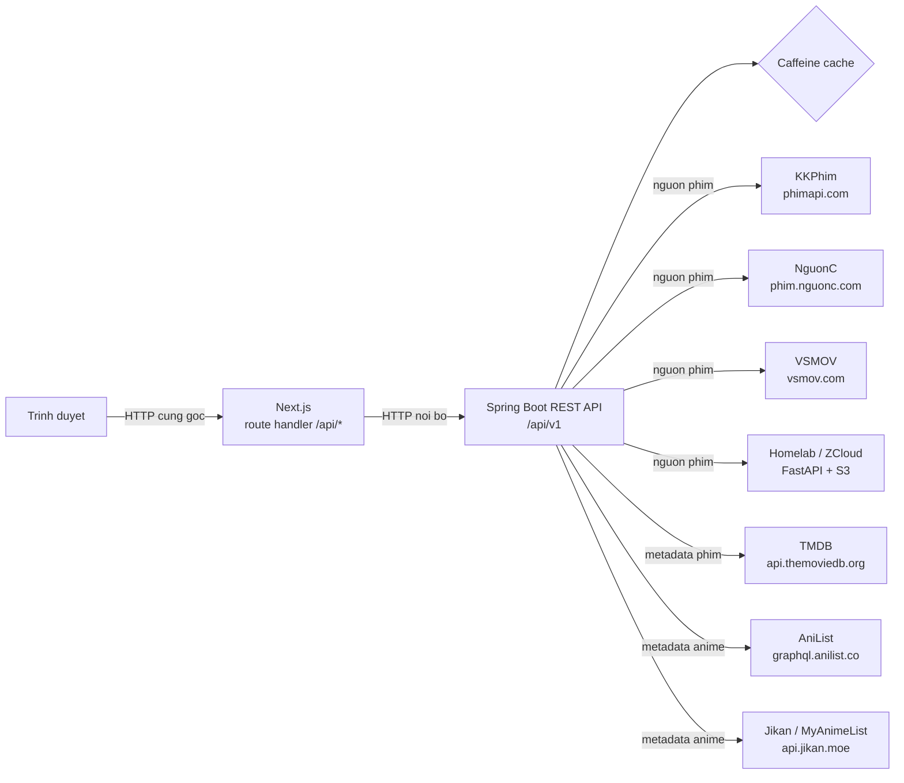

# Tổng quan hệ thống RapPhim WareHouse

> **Tài liệu:** Tổng quan hệ thống RapPhim WareHouse
> **Phiên bản:** 1.0
> **Cập nhật:** 2026-09-11
> **Đối tượng đọc:** Người mới tiếp cận dự án, quản lý kỹ thuật, người tích hợp
> **Trạng thái:** Chính thức
> **Tag:** tổng-quan, kiến-trúc, backend, frontend, nguồn-phim, metadata

## Giới thiệu

RapPhim WareHouse là một kho phim web. Chúng ta xây nó để giải quyết một vấn đề rất
cụ thể: có nhiều nguồn phim khác nhau, mỗi nguồn trả về JSON theo một định dạng riêng,
và không nguồn nào giống nguồn nào. Nếu để frontend tự gọi từng nguồn, giao diện sẽ
phải hiểu bốn "phương ngữ" JSON, xử lý bốn kiểu phân trang, bốn cách đặt tên trường —
mỗi lần thêm nguồn là một lần sửa lại toàn bộ giao diện.

Hệ thống đặt một **lớp trung gian** ở giữa để gánh việc đó. Backend gọi các nguồn bên
ngoài, đưa những định dạng khác nhau về **một schema DTO duy nhất**, cache lại kết quả
rồi phục vụ frontend. Nhờ vậy frontend chỉ cần biết một hợp đồng dữ liệu, không cần
biết nguồn nào đứng sau. Thêm nguồn mới nghĩa là viết thêm một provider ở backend, còn
giao diện gần như không phải đổi.

Ngoài phim, backend còn tổng hợp **metadata**: thông tin phim điện ảnh từ TMDB (kèm
xuất file NFO cho trình quản lý media) và metadata anime từ AniList / Jikan. Toàn bộ
API được mô tả bằng Swagger UI sinh tự động từ annotation trong mã, nên tài liệu không
bao giờ lệch với hiện thực.

Tài liệu này cho bạn bức tranh toàn cảnh: hệ thống gồm những gì, dữ liệu chảy ra sao,
và đọc tiếp ở đâu.

## Các thành phần chính

Dự án gồm hai tầng chạy độc lập, cộng một số dịch vụ hạ tầng khi triển khai bằng Docker.

| Thành phần | Công nghệ | Cổng | Vai trò |
|---|---|---|---|
| `backend/` | Spring Boot 4.1.1 (Java 17, Maven Wrapper) | 8080 | REST API tổng hợp nhiều nguồn phim, chuẩn hoá về một schema DTO, bổ sung metadata TMDB / AniList / Jikan, cache Caffeine, có Swagger UI |
| `frontend/` | Next.js 16.3.4 (App Router), React 19.2.8, Tailwind CSS 4, hls.js | 3000 | Giao diện xem phim theo phong cách YouTube; mọi lời gọi API đi qua route handler cùng gốc của chính Next |
| `dns` (khi deploy) | CoreDNS 1.14.7 (DNS-over-TLS) | nội bộ | Bộ phân giải tên miền riêng để vượt chặn DNS của ISP; container `rapphim-dns` ở IP tĩnh `172.29.0.53` |

Trên homelab, cổng 8080 đã có dịch vụ khác (ZCloud) dùng rồi, nên backend được **đưa
ra ngoài ở cổng 7101** và web ở **7100**. Bên trong mạng Docker, hai container vẫn nghe
8080 và 3000 như bình thường.

| Container | Ánh xạ cổng (homelab) | Cổng nội bộ |
|---|---|---|
| `rapphim-backend` | `7101` | `8080` |
| `rapphim-web` | `7100` | `3000` |
| `rapphim-dns` | — (chỉ nội bộ) | `53` |

## Kiến trúc hai tầng và luồng dữ liệu

Frontend không bao giờ gọi thẳng backend từ trình duyệt. Mọi lời gọi đi qua route
handler cùng gốc của Next (`/api/*`), route handler này mới gọi backend. Backend đứng
trước một loạt nguồn bên ngoài, chuẩn hoá dữ liệu và cache lại.



Nếu môi trường của bạn không dựng được sơ đồ Mermaid, đây là cùng một luồng dưới dạng
văn bản:

```
Trinh duyet
    |  HTTP cung goc (route handler /api/* cua Next)
    v
Next.js (frontend, cong 3000 / homelab 7100)
    |  HTTP noi bo -> API_INTERNAL_URL
    v
Spring Boot REST API (backend, cong 8080 / homelab 7101)
    |
    +--> Caffeine cache (tra ngay neu con han)
    |
    +--> KKPhim        (phimapi.com)          -- nguon phim
    +--> NguonC        (phim.nguonc.com)       -- nguon phim
    +--> VSMOV         (vsmov.com)             -- nguon phim
    +--> Homelab       (ZCloud: FastAPI + S3)  -- kho phim rieng
    +--> TMDB          (api.themoviedb.org/3)  -- metadata phim + NFO
    +--> AniList       (graphql.anilist.co)    -- metadata anime
    +--> Jikan/MAL     (api.jikan.moe/v4)      -- metadata anime (du phong)
```

Backend nhận rất nhiều định dạng JSON đầu vào và trả ra **một** envelope thống nhất
cho frontend:

```java
// common/ApiResponse.java - envelope chuan cho moi response
public record ApiResponse<T>(
        boolean success,   // true neu request duoc xu ly thanh cong
        String message,    // thong diep mo ta ket qua
        T data,            // du lieu nghiep vu
        Instant timestamp  // thoi diem server tra ve (UTC)
) { }
```

## Các nguồn phim và nguồn metadata

Danh sách nguồn phim là một enum ở backend; mỗi nguồn có một mã ngắn (`code`) truyền
qua tham số `provider` của các endpoint.

```java
// dto/ProviderType.java - cac nguon du lieu phim ma he thong ho tro
public enum ProviderType {
    KKPHIM("kkphim"),   // KKPhim  - phimapi.com
    NGUONC("nguonc"),   // NguonC  - phim.nguonc.com
    VSMOV("vsmov"),     // VSMOV   - vsmov.com
    HOMELAB("homelab"); // Kho phim rieng tren homelab, doc qua ZCloud
}
```

Các nguồn cấu hình trong `backend/src/main/resources/application.yml`:

| Nguồn | Mã | Loại | Địa chỉ | Ghi chú |
|---|---|---|---|---|
| KKPhim | `kkphim` | Nguồn phim | `https://phimapi.com` | Nguồn phim mặc định khi không truyền `provider` |
| NguonC | `nguonc` | Nguồn phim | `https://phim.nguonc.com` | Định dạng JSON khác hẳn KKPhim, được chuẩn hoá về cùng schema |
| VSMOV | `vsmov` | Nguồn phim | `https://vsmov.com` | Ảnh là URL tuyệt đối nên không cần gốc CDN |
| Homelab | `homelab` | Kho phim riêng | ZCloud (FastAPI + S3), mặc định `http://192.168.100.169:8080` | Đọc qua ZCloud bằng `ZCLOUD_API_KEY` hoặc `ZCLOUD_PASSWORD`; thiếu cả hai thì nguồn này trả rỗng, phần còn lại vẫn chạy |
| TMDB | — | Metadata phim | `https://api.themoviedb.org/3` | Làm giàu chi tiết phim và xuất file NFO; cần `TMDB_ACCESS_TOKEN` (token v4) hoặc `TMDB_API_KEY` (khoá v3), thiếu cả hai thì các endpoint TMDB trả 503 |
| AniList | — | Metadata anime | `https://graphql.anilist.co` | GraphQL, không cần khoá, không phát video |
| Jikan / MyAnimeList | — | Metadata anime | `https://api.jikan.moe/v4` | REST, không khoá; nguồn **dự phòng** cho AniList |

Nguồn phim và nguồn metadata anime tuân theo hai hợp đồng interface riêng
(`MovieProvider` và `AnimeMetadataProvider`), nên thêm một nguồn thứ n chỉ cần hiện
thực đúng interface tương ứng — phần còn lại của hệ thống không phải biết.

## Chuẩn hoá về một schema

Đây là triết lý gốc của backend: bốn nguồn phim với bốn định dạng JSON được ép về
**một** DTO chung. Frontend chỉ làm việc với DTO này, không bao giờ chạm định dạng thô
của nguồn.

```java
// dto/MovieSummary.java - schema tom tat mot phim (da chuan hoa)
public record MovieSummary(
        String id, String slug, String name, String originName,
        String posterUrl, String thumbUrl, Integer year, String type,
        String quality, String lang, String time, String episodeCurrent,
        List<Taxonomy> categories, List<Taxonomy> countries,
        TmdbRef tmdb, ImdbRef imdb,   // dinh danh TMDB / IMDb, null neu nguon khong cung cap
        String provider,    // nguon da tra ve phim nay
        String modifiedAt
) { }
```

Trường `provider` đi kèm mỗi phim cho biết nó đến từ nguồn nào — dữ liệu đã thống nhất
về hình dạng, nhưng vẫn truy được nguồn gốc.

## Cache Caffeine

Gọi lại nguồn ngoài cho mỗi request là lãng phí và chậm. Backend đặt một lớp cache
trong bộ nhớ (Caffeine) trước các nguồn, mỗi loại dữ liệu có tuổi thọ riêng theo mức độ
thay đổi của nó. Mọi cache đều có `maximumSize` (quy ước bắt buộc của repo — cache
không chặn kích thước là rò rỉ bộ nhớ chờ sẵn).

| Cache | `maximumSize` | Hết hạn sau | Lý do |
|---|---|---|---|
| `movieLists` | 500 | 5 phút | Danh sách phim đổi mới nhanh nên giữ ngắn |
| `movieDetails` | 1000 | 30 phút | Chi tiết phim ổn định hơn, giữ lâu hơn |
| `taxonomies` | 32 | 12 giờ | Thể loại / quốc gia gần như tĩnh |
| `homelabLibrary` | 4 | 3 phút | Cây file kho riêng; giữ ngắn để phim mới copy vào là thấy ngay, không phải khởi động lại |

Cấu hình đầy đủ ở `backend/src/main/java/com/rapphim/warehouse/config/CacheConfig.java`.

## Bề mặt API

Toàn bộ endpoint nằm dưới tiền tố `/api/v1`. Bảng dưới liệt kê các nhóm chính theo
controller để bạn định vị nhanh; danh sách đầy đủ và có thể gọi thử nằm ở Swagger UI.

| Nhóm | Tiền tố | Vai trò |
|---|---|---|
| Phim | `/api/v1/movies` | Mới nhất, theo loại, tìm kiếm, theo thể loại / quốc gia / năm, chi tiết theo slug, lấy nhiều phim (`/batch`) |
| Anime | `/api/v1/anime` | Thịnh hành, tìm kiếm, chi tiết theo id, danh sách thể loại |
| Homelab | `/api/v1/homelab` | Phục vụ tài nguyên kho riêng, ví dụ phụ đề (`/subtitle`, trả `text/vtt`) |
| TMDB / NFO | `/api/v1` | Metadata TMDB cho một phim, xuất NFO (`/movies/{slug}/nfo`), khám phá, chi tiết, nhân vật, thể loại |
| Hệ thống | `/api/v1` | `/status` (tình trạng cấu hình), `/providers` (mã nguồn đang hoạt động), `/list-types` |
| Taxonomy | `/api/v1` | `/categories`, `/countries` |
| Quản trị | `/api/v1/admin` | Nhật ký kiểm toán, cấu hình khoá, quản lý nguồn tự thêm (cần `RAPPHIM_ADMIN_TOKEN`) |

Địa chỉ tài liệu và giám sát:

| Đường dẫn | Nội dung |
|---|---|
| `http://localhost:8080/swagger-ui.html` | Swagger UI, gọi thử trực tiếp |
| `http://localhost:8080/v3/api-docs` | OpenAPI 3.1 JSON (sinh tự động) |
| `docs/openapi.json` | Bản xuất tĩnh của đặc tả OpenAPI |
| `http://localhost:8080/actuator/health` | Health check |

Thử nhanh health check của backend:

```bash
# Kiem tra backend con song (chay khi backend dang bat)
curl -s http://localhost:8080/actuator/health
```

**Kết quả:**

```json
{"status":"UP"}
```

## Cấu hình và triển khai

Backend đọc các khoá nhạy cảm từ biến môi trường (hoặc trang quản trị `/cms`), không
bao giờ hardcode. Các biến thường gặp:

| Biến môi trường | Vai trò | Thiếu thì sao |
|---|---|---|
| `RAPPHIM_CORS_ORIGINS` | Địa chỉ frontend được phép gọi API | Trình duyệt chặn lời gọi khác gốc |
| `TMDB_ACCESS_TOKEN` / `TMDB_API_KEY` | Khoá TMDB (token v4 ưu tiên) | Các endpoint TMDB trả 503, phần còn lại chạy |
| `ZCLOUD_API_KEY` / `ZCLOUD_PASSWORD` | Truy cập kho riêng homelab | Nguồn homelab tự tắt, phần còn lại chạy |
| `RAPPHIM_ADMIN_TOKEN` | Bảo vệ trang quản trị | Chỉ xem được, không sửa được nguồn |
| `API_INTERNAL_URL` (web) | Địa chỉ backend mà route handler của Next gọi tới | Frontend không gọi được backend |

Triển khai homelab qua `deploy.sh` (đóng gói `tar` rồi gửi qua SSH) kết hợp
`docker compose` với ba dịch vụ `dns` / `backend` / `web`. Bản phát hành dùng
`docker-compose.prod.yml` **kéo** ảnh dựng sẵn từ GHCR chứ không build trên VPS. Dịch
vụ `dns` chạy CoreDNS với DNS-over-TLS để vượt chặn DNS của ISP; container backend được
trỏ về bộ phân giải này bằng địa chỉ IP tĩnh `172.29.0.53` (ở mức đó Docker chưa nhận
tên dịch vụ).

Dịch vụ thuyết minh (dub) **hiện đang tắt** trong `docker-compose.yml`: khối ML nặng
(PaddleOCR ONNX + ffmpeg + TTS) quá sức homelab hiện tại. Mã nguồn vẫn còn ở thư mục
`dub/` và tầng giao diện; muốn bật lại thì thêm service, đặt `DUB_INTERNAL_URL` cho web
và bật cờ `NEXT_PUBLIC_DUB_ENABLED`.

## Kết luận

RapPhim WareHouse gom nhiều nguồn phim và nhiều nguồn metadata về sau **một** lớp
backend Spring Boot: backend chuẩn hoá tất cả về một schema DTO, cache bằng Caffeine
theo tuổi thọ từng loại dữ liệu, rồi phục vụ một frontend Next.js gọi qua route handler
cùng gốc. Kiến trúc này giữ cho giao diện đơn giản và cho phép thêm nguồn mới mà không
đụng tới phần còn lại.

Đọc tiếp:

- [`README.md`](../../README.md) — cách chạy backend và frontend tại máy.
- [`AGENTS.md`](../../AGENTS.md) — hiến pháp cho agent: quy ước vận hành, ranh giới an
  toàn, lệnh chuẩn và bản đồ dự án.
- [`docs/openapi.json`](../openapi.json) và Swagger UI — đặc tả API đầy đủ, gọi thử được.
- [`docs/ebook/README.md`](../ebook/README.md) — sổ tay sự cố thật và các nguyên tắc
  vận hành rút ra từ dự án.
